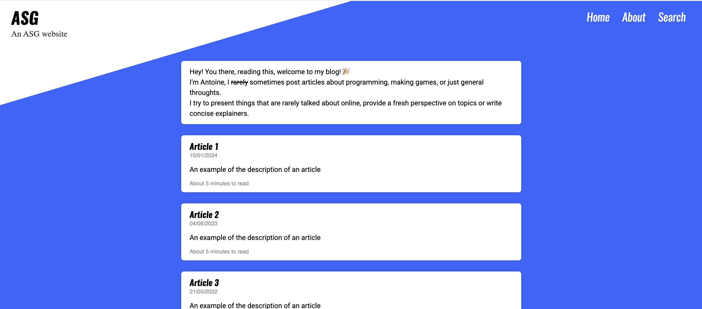

<div align="center">
    <h1>Awesome Static Generator</h1>
    <em>⭐ Converts Markdown into a Website ⭐</em>
    <div>
    
    
    </div>
</div>

## The concept

Create websites like blogs, documentation or portfolios by writing [Luau](https://luau.org/) code!

```md
Last updated at *{{ os.date() }}*

# Fibonacci


## List of fibonacci numbers
<ul>

	<li>The {{ i+2 }}th fibonacci number is $ {{ v }} = {{ fiboList[i+1] }} + {{ fiboList[i]}} $.</li>

</ul>
```

You can mix Markdown, Luau and Latex! ASG is the ideal playground to learn Luau or build your website.
Get started using [a theme](./assets/themes/) or from scratch.

The modern theme looks like this:



## Getting started

Go to the [release page](https://github.com/vanyle/ASG/releases) and download the latest version for your OS.
Unzip the file where you want and add the location to your path.

You can also use the following commands that do the same and install asg to `~/.asg`:

On Linux, you can do:
```bash
curl -fsSL https://raw.githubusercontent.com/vanyle/ASG/refs/heads/master/install/get_asg_linux.sh | sh
```

On MacOS:
```bash
curl -fsSL https://raw.githubusercontent.com/vanyle/ASG/refs/heads/master/install/get_asg_macos.sh | sh
```

On Windows (with Powershell):
```powershell
irm "https://raw.githubusercontent.com/vanyle/ASG/refs/heads/master/install/get_asg_win.ps1" | iex
```

To start ASG, do: `asg <input_directory> <output_directory>`

The static website will be generated inside `<output_directory>`

More information available inside [the reference](./docs/reference.md)

Check out [how to use ASG with Github Pages to publish your website](./docs/github.md)

## Key features

- Write markdown
- **Lua scripting** for templates
- Use and extend existing templates or create your own
- Support **latex**, **mermaid diagrams** and **code highlighting**
- Generate HTML with fast load times by building dependencies and only including them when necessary
- **Standalone executable** (no dependencies)
- **Live reloading**.
- Reasonable (sub-second) build times, even when incremental builds are disabled

## What makes ASG different from other website generators?

There are many static site generators that can be used to write blogs, however, most lack at least some of the following features:

- No dependencies (No Ruby, No Node, No Luau installation, nothing to install other than the executable)
- Turing-complete templates (templates can really do anything, like fetching data from the web or running other programs)
- Templates are not based on a domain specific language (aka they use an executing well known language)
- Reasonable build times (a.k.a not noticable for regular users)

You can view ASG (Awesome Static Generator) as a compiler for HTML (or anything really).
You can build websites quicker with it (or just generate plain text).

You have access to components, you can make interactive demos and tutorials, everything!
With pandoc, you can even convert this to a pdf.

The templates provided are very powerful as they can define Luau function that you can later use, making asg
incredibly useful when creating interactive documents (with graphs and others), or just making blogs.

ASG is written in Rust with bits of Luau code for the HTML generation. It's overall pretty fast. In live reload mode
the time between you saving your file and the browser refreshing to render the new page is about 10 ms, which
is good enough for live preview.

ASG might be slower is you put very complex tasks in Luau (or a sleep / network access).

## Examples

You can see examples in the [`tests` folder](./tests/).
Every subfolder contains a different website that can be built.
You can take an example and extend it to create your own website!

## Security

ASG websites can perform almost any operation during website compilation. Avoid building blogs you don't trust.

While Luau provides some sandboxing, ASG allows the Luau code to read any file inside the input and output directory provided and
Internet access. Little security effort has been put into making sure that Luau code is not able to escape this sandbox.
