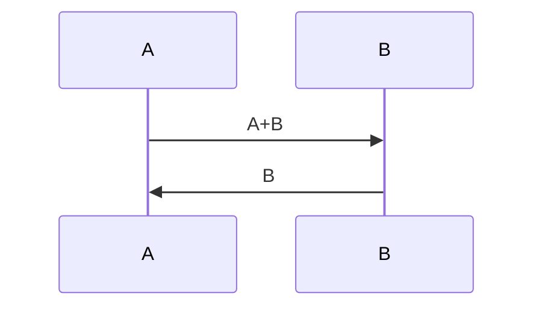

{%
	setvar("layout","assets/light.html")
	head = ""
	birth = 2000
	current_year = os.date("%Y")
%}




## Fibonacci numbers

Fibonacci numbers are a sequence that verifies the equation: \\( f_{n+1} = f_{n+1} + f_{n} \\) with \\( f_0 = 0, f_1 = 1 \\).

*Written at {{ os.date() }}*

Hi, I'm {{ name }}, I'm {{ math.floor(current_year - birth) }} years old and i like rambling about my life on the internet.


The program below will print the first {{example_count}} fibonacci numbers:
```python
a,b = 0,1
for i in range({{example_count}}):
	print(a)
	a,b = b, a+b
```

Quick explaination of how the program works with a diagram.



The output will be:




The {{i}}th fibonacci number is {{ value_table[i] }} <br/>



