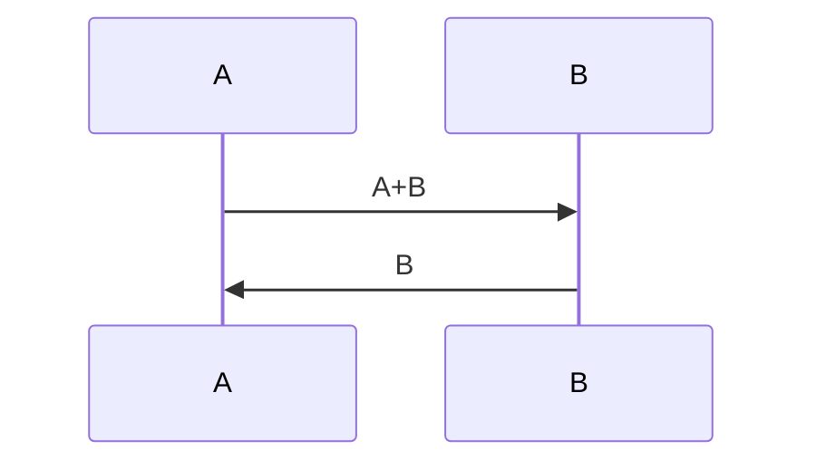

{%
	setvar("layout",theme .. ".html")
	head = ""
	current_year = os.date("%Y")
%}



## Fibonacci numbers

Fibonacci numbers are a sequence that verifies the equation: $f_{n+1} = f_{n+1} + f_{n}$ with \\[f_0 = 0, f_1 = 1\\].

The program below will print the first {{example_count}} fibonacci numbers:

{{ highlight_syntax([[
a,b = 0,1
for i in range(30):
    print(a)
    a,b = b, a+b
]], "py") }}

Quick explaination of how the program works with a diagram.

The output will be:




The {{i}}th fibonacci number is {{ value_table[i] }}  


You can also compute fibonacci recursively.



The 10th fibonacci number is {{ fibo_rec(30) }}